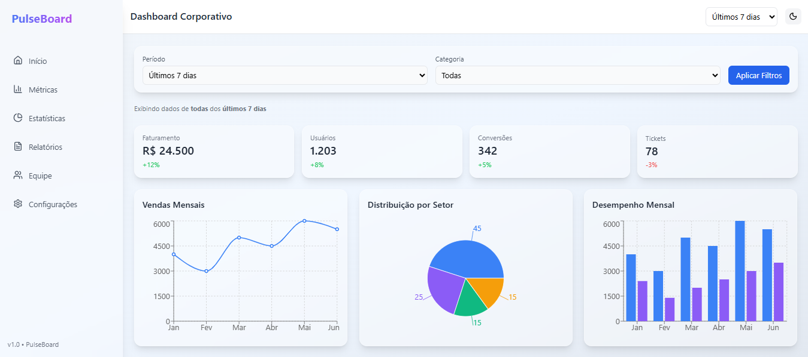
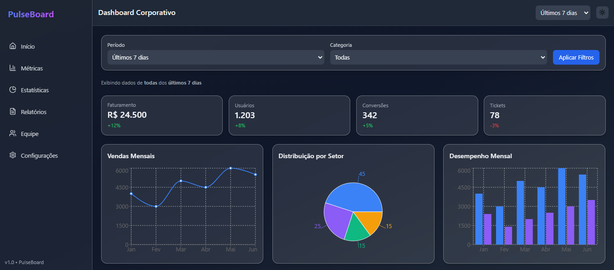

# Dashboard Corporativo

<div align="center">


[](https://erikalaiane.github.io/dashboard-corporativo/)

[**🚀 Ver Projeto Ao Vivo**](https://erikalaiane.github.io/dashboard-corporativo/)

</div>

## Sobre o Projeto

Dashboard corporativo moderno e responsivo desenvolvido em React, utilizando Tailwind CSS para estilização e Recharts para visualização de gráficos interativos. Interface intuitiva com suporte a dark mode, filtros de dados e design glassmorphism.

---

## Tecnologias Utilizadas

- **[React](https://react.dev/)** - Biblioteca JavaScript para construção de interfaces de usuário
- **[Tailwind CSS](https://tailwindcss.com/)** - Framework CSS utility-first para design responsivo e estilização rápida
- **[Recharts](https://recharts.org/)** - Biblioteca para gráficos interativos em React
- **[Vite](https://vitejs.dev/)** - Build tool moderna e extremamente rápida para desenvolvimento frontend

---

## Funcionalidades

- Dashboard com cards de métricas em tempo real
- Gráficos interativos (linha, barra e pizza)
- Filtros de período e categoria
- Dark mode com toggle suave
- Sidebar fixa e totalmente responsiva
- Design moderno com glassmorphism e animações fluidas
- Performance otimizada com Vite

---

## Como Rodar o Projeto

### Pré-requisitos

- Node.js (versão 14 ou superior)
- npm ou yarn

### Instalação

1. **Clone o repositório**

```bash
git clone https://github.com/erikalaiane/dashboard-corporativo.git
```

2. **Entre na pasta do projeto**

```bash
cd dashboard-corporativo
```

3. **Instale as dependências**

```bash
npm install
```

4. **Execute o projeto**

```bash
npm run dev
```

O projeto estará disponível em `http://localhost:5173`

---

## Estrutura do Projeto

```
src/
├── components/              # Componentes reutilizáveis
│   ├── BarChartSection.jsx  # Gráfico de barras
│   ├── CardMetric.jsx       # Card de métrica individual
│   ├── ChartSection.jsx     # Container para gráficos
│   ├── FilterBar.jsx        # Barra de filtros
│   ├── Header.jsx           # Cabeçalho do dashboard
│   ├── LineChartSection.jsx # Gráfico de linhas
│   ├── PieChartSection.jsx  # Gráfico de pizza
│   └── Sidebar.jsx          # Barra lateral de navegação
├── pages/
│   └── Dashboard.jsx        # Página principal do dashboard
├── context/
│   └── ThemeContext.jsx     # Contexto para gerenciamento do tema
├── assets/                  # Imagens e recursos estáticos
├── App.jsx                  # Componente principal
└── main.jsx                 # Ponto de entrada
```

---

## Preview

### Dashboard Light Mode


### Dashboard Dark Mode


---

## Scripts Disponíveis

```bash
npm run dev      # Inicia o servidor de desenvolvimento
npm run build    # Cria build de produção
npm run preview  # Preview da build de produção
npm run lint     # Executa o linter
npm run deploy   # Faz deploy para GitHub Pages
```

---

## Contribuindo

Contribuições são sempre bem-vindas! Para contribuir:

1. Faça um fork do projeto
2. Crie uma branch para sua feature (`git checkout -b feature/MinhaFeature`)
3. Commit suas mudanças (`git commit -m 'Adiciona nova feature'`)
4. Push para a branch (`git push origin feature/MinhaFeature`)
5. Abra um Pull Request

---

## Autora

**Erika Laiane**

[](https://github.com/erikalaiane)
[](https://www.linkedin.com/in/erika-laiane-azevedo)

---

<div align="center">

Desenvolvido com ❤️ por Erika Laiane

</div>